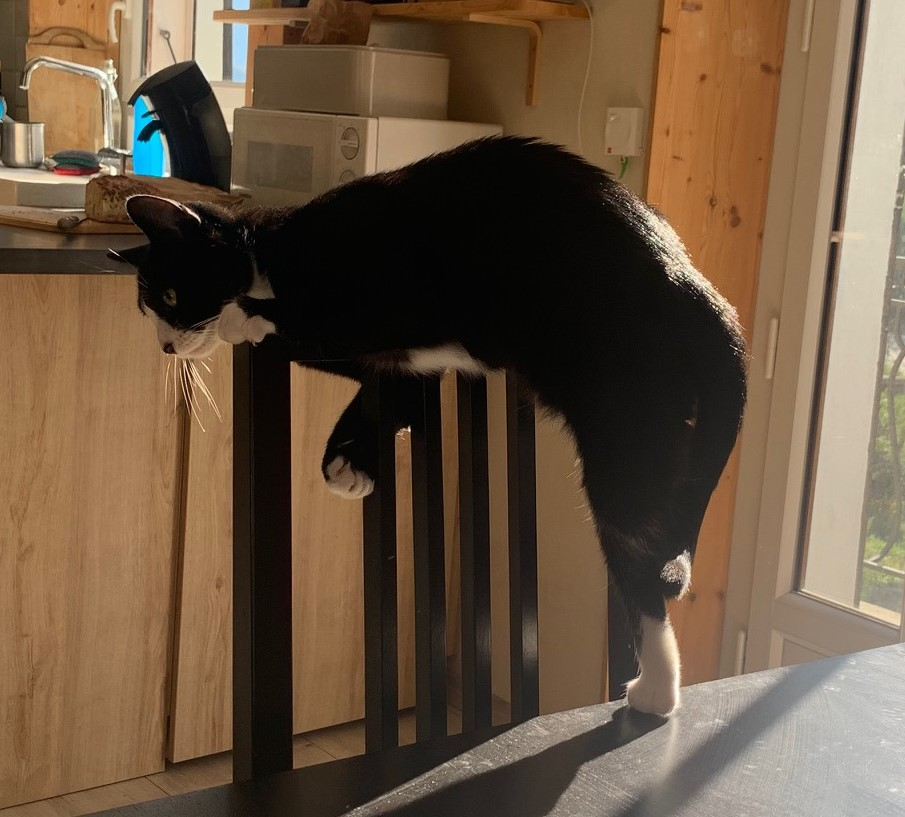
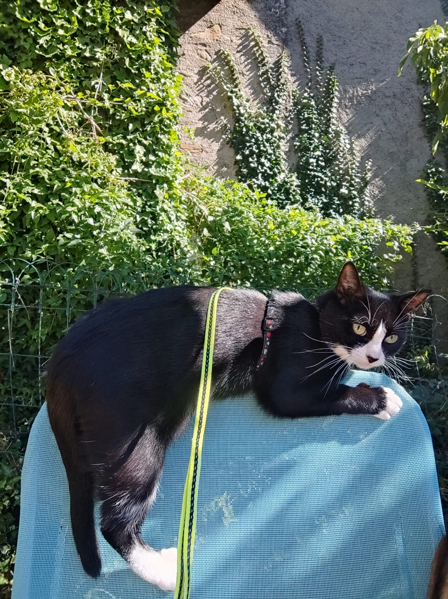

Si vous faîtes face à quelques doutes, voici des photos pour vous remotiver :

Plus sérieusement, si vous êtes ici il n'est pas impossible que vous soyez en CPGE ou en préparation à l'agrégation. Ce sont des années exigeantes qui peuvent parfois s'avérer difficiles à encaisser seul.e. Vous pouvez vous faire accompagner par un psychologue notamment via le dispositif Santé Psy Etudiant, dont vous pouvez consulter les modalités juste [ici](https://santepsy.etudiant.gouv.fr/).
